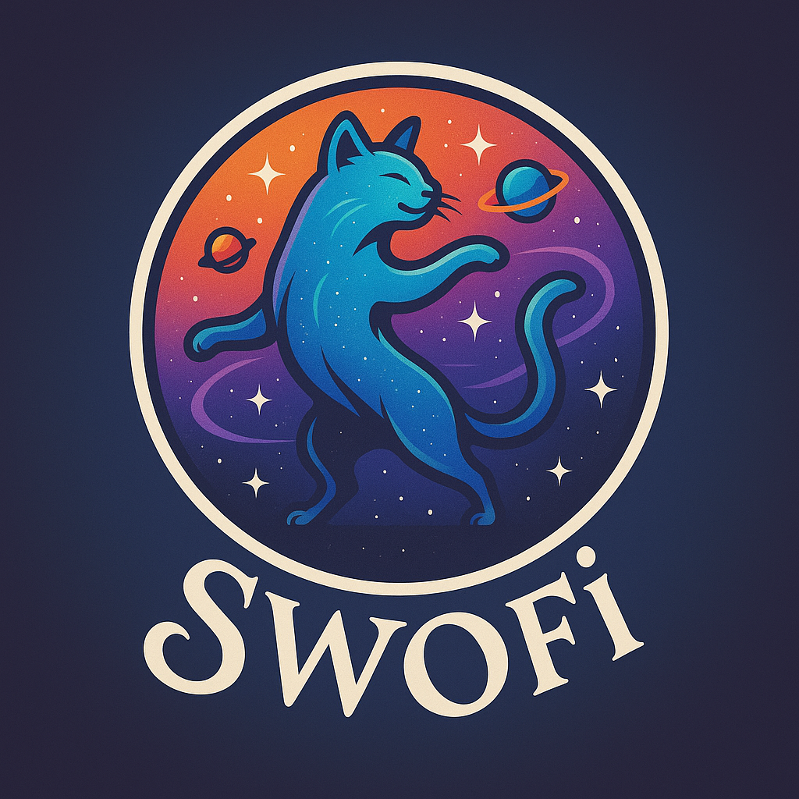

  <picture>
    
  </picture>
  <h2 align="center">
    Swofi Telegram Event Bot 🕺💃
  </h2>

⚠️ **BETA VERSION - v0.9.1**

A Telegram bot designed to help you discover and share dance events, parties, and cultural happenings. The name “Swofi” is derived from the German slang term “Schwofen,” which means dancing the night away 🤣

## Features

- 📝 Submit new events with detailed information
- 🖼️ Add images to event submissions
- 📅 Include date, time and location
- 🏷️ Categorize events (Dance, Music, Concert etc.)
- 🔍 Search for events by date 🔥
- ✅ Optional Admin approval system
- 📢 Automatic posting to a Telegram channel
- 🌐 Support for external links

## Technical Stack

- TypeScript
- grammY (Telegram Bot Framework)
- Prisma (Database ORM)
- Node.js

## Getting Started

### Prerequisites

- Node.js
- PostgreSQL
- Telegram Bot Token
- Telegram Channel ID
- Configure environment variables

### Installation

1. Install dependencies: `npm install` or `pnpm install`
2. Generate Prisma Client: `npx prisma generate`
3. Start PostgreSql DB
4. Run `npx prisma migrate dev`
5. Configure Enviorements
6. Start the development server: `npm run dev` or `pnpm dev`
7. Build for production `pnpm run build`

### Languages

1. Open .env file
2. Set the `LOCALE` to `de` or `en`
3. Restart the bot

You found the translations in the locales folder.

LICENSE MIT - see [LICENSE](LICENSE)
